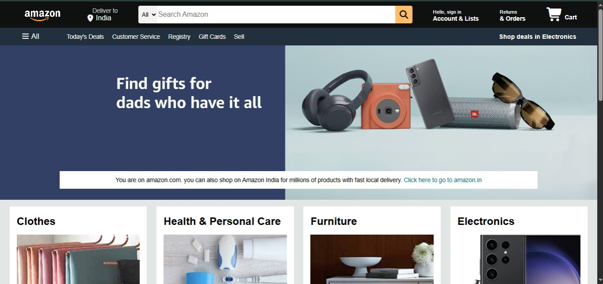
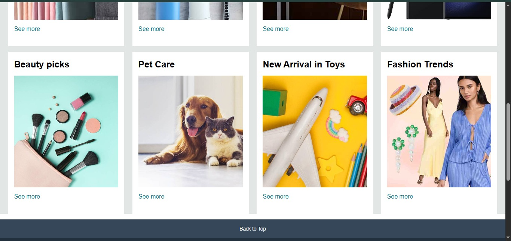
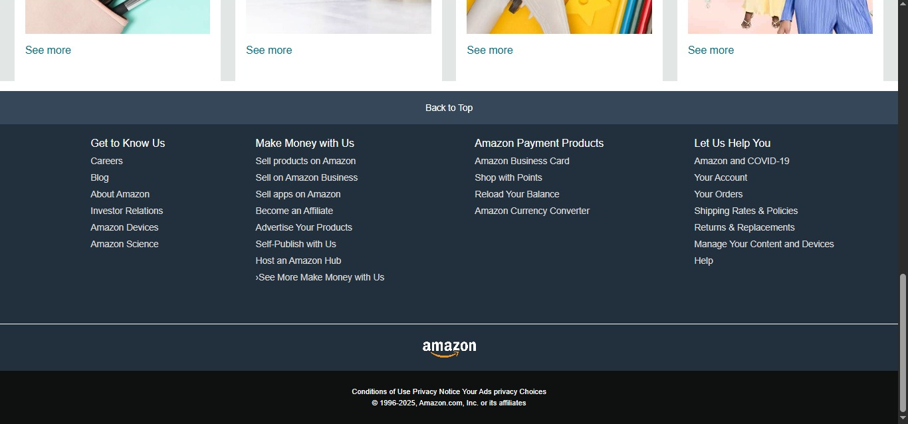

# Amazon-Clone (Frontend Only)

This is a frontend clone of the Amazon website built using HTML, CSS. It replicates the layout and design of the Amazon homepage and UI elements.

## Description
- Styled using CSS (Flexbox & Grid)
- Includes header, search bar, product listings, and footer

## Technologies Used
- ✅ HTML
- ✅ CSS (Flexbox, Grid)

## Screenshots

### Homepage Top Section

### Product Grid Section

### Footer Section

